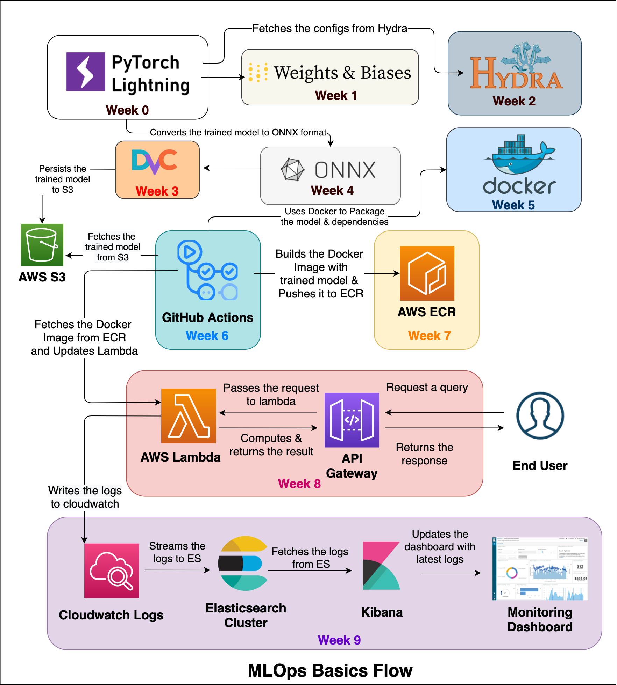
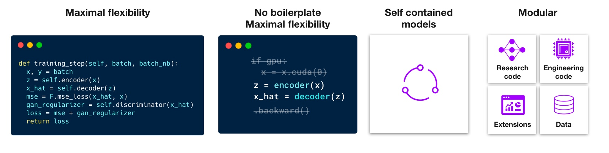
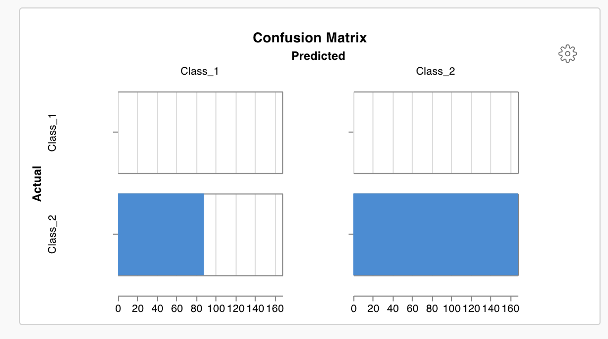
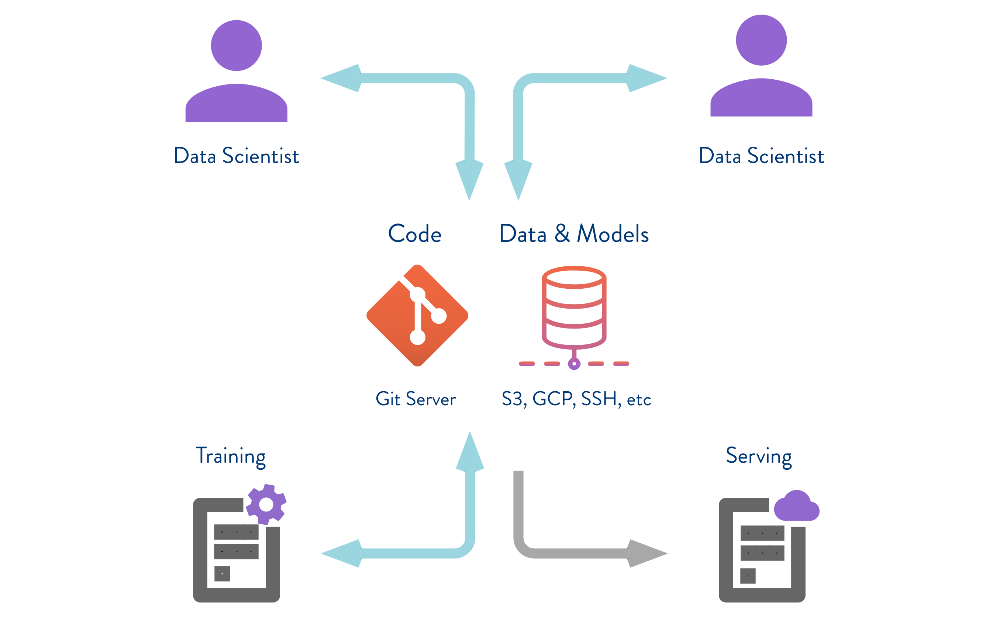
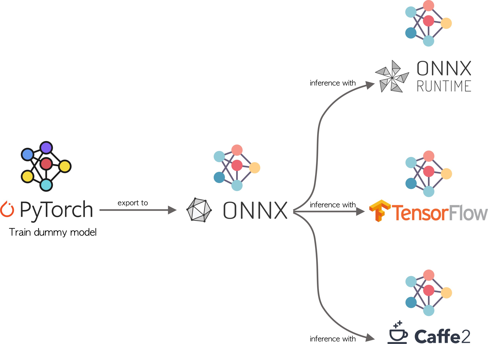
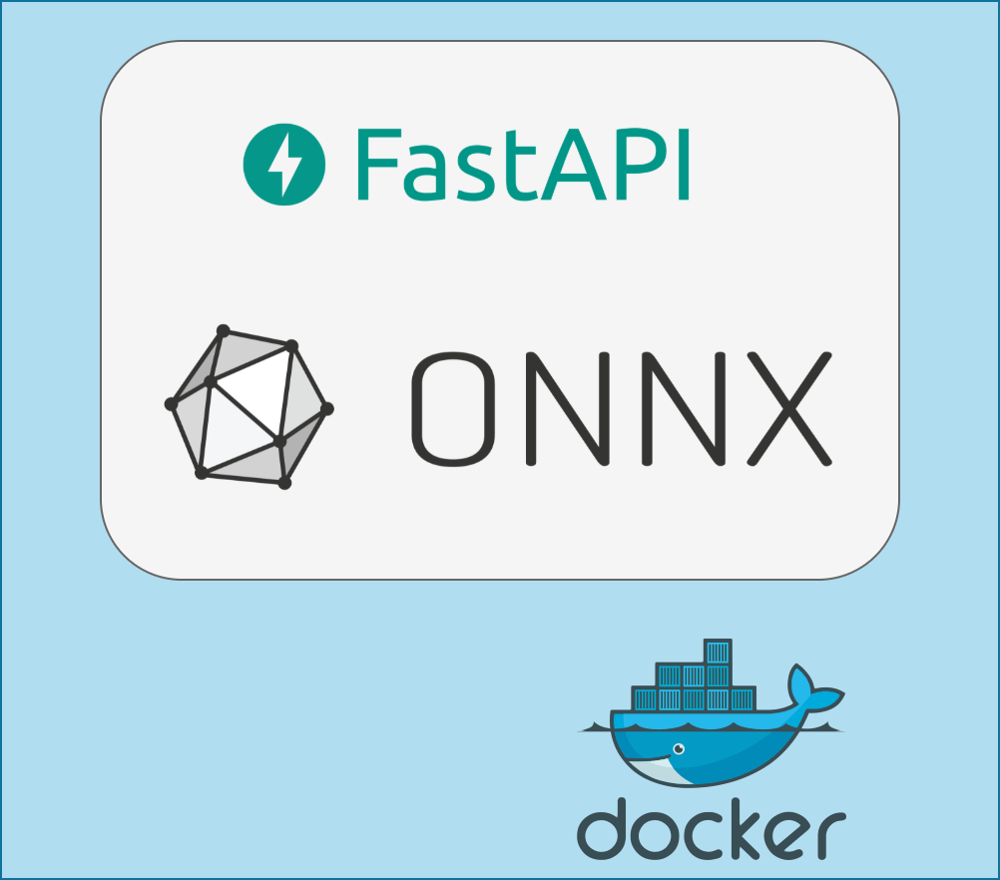
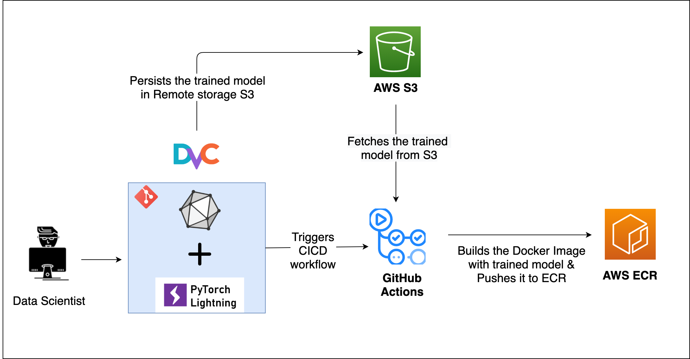
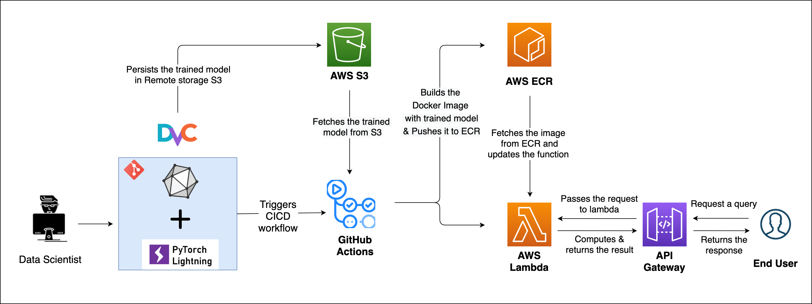
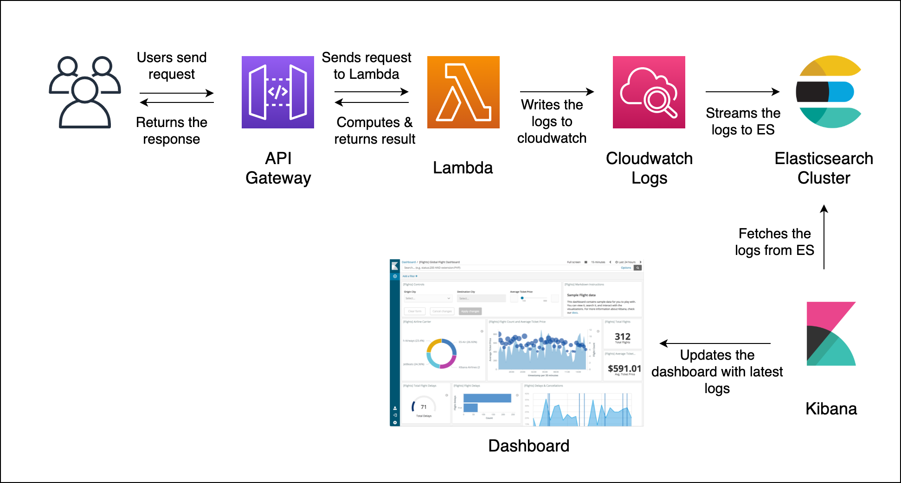

# MLOps-Basics

 > There is nothing magic about magic. The magician merely understands something simple which doesn’t appear to be simple or natural to the untrained audience. Once you learn how to hold a card while making your hand look empty, you only need practice before you, too, can “do magic.” – Jeffrey Friedl in the book Mastering Regular Expressions

**Note: Please raise an issue for any suggestions, corrections, and feedback.**

The goal of the series is to understand the basics of MLOps like model building, monitoring, configurations, testing, packaging, deployment, cicd, etc.

## Week 0: Project Setup

Refer to the [Blog Post here](https://www.ravirajag.dev/blog/mlops-project-setup-part1)

The project I have implemented is a simple classification problem. The scope of this week is to understand the following topics:

- `How to get the data?`
- `How to process the data?`
- `How to define dataloaders?`
- `How to declare the model?`
- `How to train the model?`
- `How to do the inference?`

Following tech stack is used:

- [Huggingface Datasets](https://github.com/huggingface/datasets)
- [Huggingface Transformers](https://github.com/huggingface/transformers)
- [Pytorch Lightning](https://pytorch-lightning.readthedocs.io/)

## Week 1: Model monitoring - Weights and Biases

Refer to the [Blog Post here](https://www.ravirajag.dev/blog/mlops-wandb-integration)

Tracking all the experiments like tweaking hyper-parameters, trying different models to test their performance and seeing the connection between model and the input data will help in developing a better model.

The scope of this week is to understand the following topics:

- `How to configure basic logging with W&B?`
- `How to compute metrics and log them in W&B?`
- `How to add plots in W&B?`
- `How to add data samples to W&B?`

Following tech stack is used:

- [Weights and Biases](https://wandb.ai/site)
- [torchmetrics](https://torchmetrics.readthedocs.io/)

References:

- [Tutorial on Pytorch Lightning + Weights & Bias](https://www.youtube.com/watch?v=hUXQm46TAKc)

- [WandB Documentation](https://docs.wandb.ai/)

## Week 2: Configurations - Hydra

Refer to the [Blog Post here](https://www.ravirajag.dev/blog/mlops-hydra-config)

Configuration management is a necessary for managing complex software systems. Lack of configuration management can cause serious problems with reliability, uptime, and the ability to scale a system.

The scope of this week is to understand the following topics:

- `Basics of Hydra`
- `Overridding configurations`
- `Splitting configuration across multiple files`
- `Variable Interpolation`
- `How to run model with different parameter combinations?`

Following tech stack is used:

- [Hydra](https://hydra.cc/)

References

- [Hydra Documentation](https://hydra.cc/docs/intro)

- [Simone Tutorial on Hydra](https://www.sscardapane.it/tutorials/hydra-tutorial/#executing-multiple-runs)

## Week 3: Data Version Control - DVC

Refer to the [Blog Post here](https://www.ravirajag.dev/blog/mlops-dvc)

Classical code version control systems are not designed to handle large files, which make cloning and storing the history impractical. Which are very common in Machine Learning.

The scope of this week is to understand the following topics:

- `Basics of DVC`
- `Initialising DVC`
- `Configuring Remote Storage`
- `Saving Model to the Remote Storage`
- `Versioning the models`

Following tech stack is used:

- [DVC](https://dvc.org/)

References

- [DVC Documentation](https://dvc.org/doc)

- [DVC Tutorial on Versioning data](https://www.youtube.com/watch?v=kLKBcPonMYw)

## Week 4: Model Packaging - ONNX

Refer to the [Blog Post here](https://www.ravirajag.dev/blog/mlops-onnx)

Why do we need model packaging? Models can be built using any machine learning framework available out there (sklearn, tensorflow, pytorch, etc.). We might want to deploy models in different environments like (mobile, web, raspberry pi) or want to run in a different framework (trained in pytorch, inference in tensorflow).
A common file format to enable AI developers to use models with a variety of frameworks, tools, runtimes, and compilers will help a lot.

This is acheived by a community project `ONNX`.

The scope of this week is to understand the following topics:

- `What is ONNX?`

- `How to convert a trained model to ONNX format?`

- `What is ONNX Runtime?`

- `How to run ONNX converted model in ONNX Runtime?`

- `Comparisions`

Following tech stack is used:

- [ONNX](https://onnx.ai/)
- [ONNXRuntime](https://www.onnxruntime.ai/)

References

- [Abhishek Thakur tutorial on onnx model conversion](https://www.youtube.com/watch?v=7nutT3Aacyw)
- [Pytorch Lightning documentation on onnx conversion](https://pytorch-lightning.readthedocs.io/en/stable/common/production_inference.html)
- [Huggingface Blog on ONNXRuntime](https://medium.com/microsoftazure/accelerate-your-nlp-pipelines-using-hugging-face-transformers-and-onnx-runtime-2443578f4333)
- [Piotr Blog on onnx conversion](https://tugot17.github.io/data-science-blog/onnx/tutorial/2020/09/21/Exporting-lightning-model-to-onnx.html)

## Week 5: Model Packaging - Docker

Refer to the [Blog Post here](https://www.ravirajag.dev/blog/mlops-docker)

Why do we need packaging? We might have to share our application with others, and when they try to run the application most of the time it doesn’t run due to dependencies issues / OS related issues and for that, we say (famous quote across engineers) that `It works on my laptop/system`.

So for others to run the applications they have to set up the same environment as it was run on the host side which means a lot of manual configuration and installation of components.

The solution to these limitations is a technology called Containers.

By containerizing/packaging the application, we can run the application on any cloud platform to get advantages of managed services and autoscaling and reliability, and many more.

The most prominent tool to do the packaging of application is Docker 🛳

The scope of this week is to understand the following topics:

- `FastAPI wrapper`
- `Basics of Docker`
- `Building Docker Container`
- `Docker Compose`

References

- [Analytics vidhya blog](https://www.analyticsvidhya.com/blog/2021/06/a-hands-on-guide-to-containerized-your-machine-learning-workflow-with-docker/)

## Week 6: CI/CD - GitHub Actions

Refer to the [Blog Post here](https://www.ravirajag.dev/blog/mlops-github-actions)

CI/CD is a coding philosophy and set of practices with which you can continuously build, test, and deploy iterative code changes.

This iterative process helps reduce the chance that you develop new code based on a buggy or failed previous versions. With this method, you strive to have less human intervention or even no intervention at all, from the development of new code until its deployment.

In this post, I will be going through the following topics:

- Basics of GitHub Actions
- First GitHub Action
- Creating Google Service Account
- Giving access to Service account
- Configuring DVC to use Google Service account
- Configuring Github Action

References

- [Configuring service account](https://dvc.org/doc/user-guide/setup-google-drive-remote)

- [Github actions](https://docs.github.com/en/actions/quickstart)

## Week 7: Container Registry - AWS ECR

Refer to the [Blog Post here](https://www.ravirajag.dev/blog/mlops-container-registry)

A container registry is a place to store container images. A container image is a file comprised of multiple layers which can execute applications in a single instance. Hosting all the images in one stored location allows users to commit, identify and pull images when needed.

Amazon Simple Storage Service (S3) is a storage for the internet. It is designed for large-capacity, low-cost storage provision across multiple geographical regions.

In this week, I will be going through the following topics:

- `Basics of S3`

- `Programmatic access to S3`

- `Configuring AWS S3 as remote storage in DVC`

- `Basics of ECR`

- `Configuring GitHub Actions to use S3, ECR`

## Week 8: Serverless Deployment - AWS Lambda

Refer to the [Blog Post here](https://www.ravirajag.dev/blog/mlops-serverless)

A serverless architecture is a way to build and run applications and services without having to manage infrastructure. The application still runs on servers, but all the server management is done by third party service (AWS). We no longer have to provision, scale, and maintain servers to run the applications. By using a serverless architecture, developers can focus on their core product instead of worrying about managing and operating servers or runtimes, either in the cloud or on-premises.

In this week, I will be going through the following topics:

- `Basics of Serverless`

- `Basics of AWS Lambda`

- `Triggering Lambda with API Gateway`

- `Deploying Container using Lambda`

- `Automating deployment to Lambda using Github Actions`

## Week 9: Prediction Monitoring - Kibana

Refer to the [Blog Post here](https://www.ravirajag.dev/blog/mlops-monitoring)

Monitoring systems can help give us confidence that our systems are running smoothly and, in the event of a system failure, can quickly provide appropriate context when diagnosing the root cause.

Things we want to monitor during and training and inference are different. During training we are concered about whether the loss is decreasing or not, whether the model is overfitting, etc.

But, during inference, We like to have confidence that our model is making correct predictions.

There are many reasons why a model can fail to make useful predictions:

- The underlying data distribution has shifted over time and the model has gone stale. i.e inference data characteristics is different from the data characteristics used to train the model.

- The inference data stream contains edge cases (not seen during model training). In this scenarios model might perform poorly or can lead to errors.

- The model was misconfigured in its production deployment. (Configuration issues are common)

In all of these scenarios, the model could still make a `successful` prediction from a service perspective, but the predictions will likely not be useful. Monitoring machine learning models can help us detect such scenarios and intervene (e.g. trigger a model retraining/deployment pipeline).

In this week, I will be going through the following topics:

- `Basics of Cloudwatch Logs`

- `Creating Elastic Search Cluster`

- `Configuring Cloudwatch Logs with Elastic Search`

- `Creating Index Patterns in Kibana`

- `Creating Kibana Visualisations`

- `Creating Kibana Dashboard`

